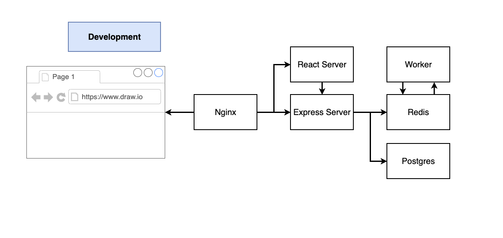
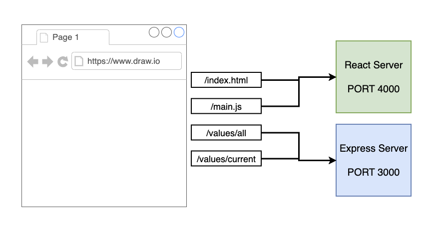
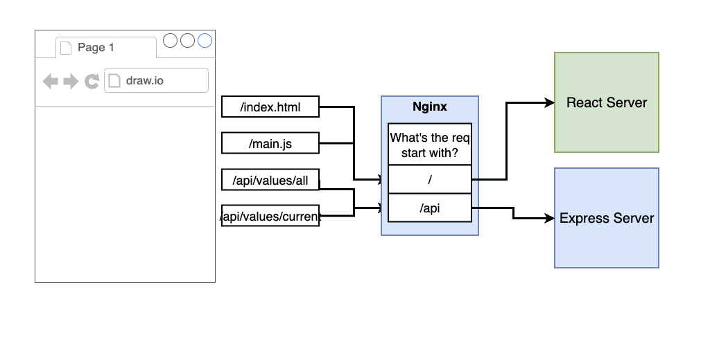

# Multi-Container Application - WIP

Overcomplicated version of a Fibonacci calculator that returns value for a given index. The purpose of this application is to showcase multi-container deployment with Docker and AWS.

## Routing

Nginx routes traffic to correct server based on the incoming request. Configuration can be found in `default.conf`

