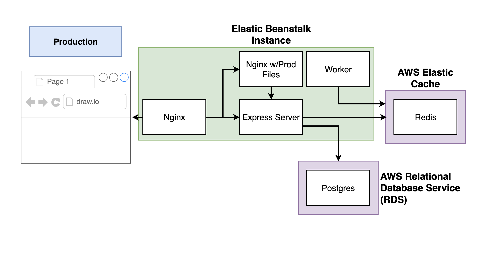

# Multi-Container Application

Overcomplicated version of a Fibonacci calculator that returns value for a given index. The purpose of this application is to showcase multi-container deployment with Docker and AWS.

## Routing

Nginx routes traffic to correct server based on the incoming request. Configuration can be found in `default.conf`

## Deployment to Elastic Beanstalk

This project uses github actions to deploy to AWS EB. Configuration can be found in `.github/workflows/deploy.yaml`. Configuration has been based on [beanstalk-deploy](https://github.com/einaregilsson/beanstalk-deploy). Deployment is triggered by a code merge to `main` branch.

## Prerequisite

In order for the pipeline to be functional you need to set up an EB application in AWS. You can find instructions on how to sign up here [AWS free tier](https://aws.amazon.com/free/?trk=bd20e73c-a932-469f-b6cf-0872a618ab7c&sc_channel=ps&ef_id=EAIaIQobChMIoKmSrZDj_wIV0OrtCh3y_wgQEAAYASAAEgKx1vD_BwE:G:s&s_kwcid=AL!4422!3!661270826084!e!!g!!aws%20free%20tier!20187389987!149698005739&all-free-tier.sort-by=item.additionalFields.SortRank&all-free-tier.sort-order=asc&awsf.Free%20Tier%20Types=*all&awsf.Free%20Tier%20Categories=*all). To create a EB application, follow the steps below:

## AWS Cheat Sheet

**Create EC2 IAM Role**

1. Go to AWS Management Console
2. Search for **IAM** and click the IAM Service.
3. Click **Roles** under **Access Management **in the left sidebar.
4. Click the **Create role** button.
5. Select **AWS Service** under **Trusted entity type** . Then select **EC2** under **common use cases** .
6. Search for **AWSElasticBeanstalk** and select both the **AWSElasticBeanstalkWorkerTier** and **AWSElasticBeanstalkMulticontainerDocker** policies. Click the **Next** button.
7. Give the role the name of **aws-elasticbeanstalk-ec2-role**
8. Click the **Create role** button.

**Create Elastic Beanstalk Environment (new application)**

1. Go to AWS Management Console
2. Search for **Elastic Beanstalk** and click the Elastic Beanstalk service.
3. Follow steps below

**You may now click the Skip to Review button as Steps 3-6 are not applicable.**

# AWS Cheat Sheet

**Elastic Beanstalk Application Creation**

1. Go to AWS Management Console and use Find Services to search for Elastic Beanstalk
2. Click “Create Application”
3. Set Application Name to 'multi-docker'
4. Scroll down to Platform and select Docker
5. Verify that "Single Instance (free tier eligible)" has been selected
6. Click the "Next" button.
7. In the "Service Role" section, verify that "Use an Existing service role" is selected.
8. Verify that aws-elasticbeanstalk-service-role has been auto-selected for the service role.
9. Verify that aws-elasticbeanstalk-ec2-role has been auto-selected for the instance profile.
10. Click "Skip to review" button.
11. Click the "Submit" button.
12. You may need to refresh, but eventually, you should see a green checkmark underneath Health.

**_RDS Database Creation_**

1. Go to AWS Management Console and use Find Services to search for RDS
2. Click Create database button
3. Select PostgreSQL
4. In Templates, check the Free tier box.
5. Scroll down to Settings.
6. Set DB Instance identifier to **multi-docker-postgres**
7. Set Master Username to **postgres**
8. Set Master Password to **postgrespassword** and confirm.
9. Scroll down to Connectivity. Make sure VPC is set to Default VPC
10. Scroll down to Additional Configuration and click to unhide.
11. Set Initial database name to **fibvalues**
12. Scroll down and click Create Database button

**_ElastiCache Redis Creation_**

1. Go to AWS Management Console and use Find Services to search for ElastiCache
2. In the sidebar under Resources, click Redis Clusters
3. Click the Create Redis cluster button
4. **Make sure Cluster Mode is DISABLED.**
5. Scroll down to Cluster info and set Name to **multi-docker-redis**
6. Scroll down to Cluster settings and change Node type to **cache.t2.micro**
7. Change Number of Replicas to **0** (Ignore the warning about Multi-AZ)
8. Scroll down to Subnet group. Select **Create a new subnet group** if not already selected.
9. Enter a name for the Subnet Group such as **redis** .
10. Scroll down and click the Next button
11. Scroll down and click the Next button again.
12. Scroll down and click the Create button.

**_Creating a Custom Security Group_**

1. Go to AWS Management Console and use Find Services to search for VPC
2. Find the Security section in the left sidebar and click Security Groups
3. Click Create Security Group button
4. Set Security group name to multi-docker
5. Set Description to multi-docker
6. Make sure VPC is set to your default VPC
7. Scroll down and click the Create Security Group button.
8. After the security group has been created, find the Edit inbound rules button.
9. Click Add Rule
10. Set Port Range to **5432-6379**
11. Click in the box next to Source and start typing 'sg' into the box. Select the Security Group you just created.
12. Click the Save rules button

**_Applying Security Groups to ElastiCache_**

1. Go to AWS Management Console and use Find Services to search for ElastiCache
2. Under Resources, click Redis clusters in Sidebar
3. Check the box next to your Redis cluster
4. Click Actions and click Modify
5. Scroll down to find Selected security groups and click Manage
6. Tick the box next to the new multi-docker group and click Choose
7. Scroll down and click Preview Changes
8. Click the Modify button.

**_Applying Security Groups to RDS_**

1. Go to AWS Management Console and use Find Services to search for RDS
2. Click Databases in Sidebar and check the box next to your instance
3. Click Modify button
4. Scroll down to Connectivity and add select the new multi-docker security group
5. Scroll down and click the Continue button
6. Click Modify DB instance button

**_Applying Security Groups to Elastic Beanstalk_**

1. Go to AWS Management Console and use Find Services to search for Elastic Beanstalk
2. Click Environments in the left sidebar.
3. Click MultiDocker-env
4. Click Configuration
5. In the Instances row, click the Edit button.
6. Scroll down to EC2 Security Groups and tick the box next to multi-docker
7. Click Apply and Click Confirm
8. After all the instances restart and go from No Data to Severe, you should see a green checkmark under Health.

**_Setting Environment Variables_**

1. Go to AWS Management Console and use Find Services to search for Elastic Beanstalk
2. Click Environments in the left sidebar.
3. Click MultiDocker-env
4. Click Configuration
5. In the Software row, click the Edit button
6. Scroll down to Environment properties
7. In another tab Open up ElastiCache, click Redis and check the box next to your cluster. Find the Primary Endpoint and copy that value but omit the :6379
8. Set REDIS_HOST key to the primary endpoint listed above, remember to omit :6379
9. Set REDIS_PORT to 6379
10. Set PGUSER to postgres
11. Set PGPASSWORD to postgrespassword
12. In another tab, open up the RDS dashboard, click databases in the sidebar, click your instance and scroll to Connectivity and Security. Copy the endpoint.
13. Set the PGHOST key to the endpoint value listed above.
14. Set PGDATABASE to fibvalues
15. Set PGPORT to 5432
16. Click Apply button
17. After all instances restart and go from No Data, to Severe, you should see a green checkmark under Health.

**_IAM Keys for Deployment_**

You can use the same IAM User's access and secret keys from the single container app we created earlier, or, you can create a new IAM user for this application:

1. Search for the "IAM Security, Identity & Compliance Service"
2. Click "Create Individual IAM Users" and click "Manage Users"
3. Click "Add User"
4. Enter any name you’d like in the "User Name" field.

eg: docker-multi-travis-ci

5. Click "Next"
6. Click "Attach Policies Directly"
7. Search for "beanstalk"
8. Tick the box next to "AdministratorAccess-AWSElasticBeanstalk"
9. Click "Next"
10. Click "Create user"
11. Select the IAM user that was just created from the list of users
12. Click "Security Credentials"
13. Scroll down to find "Access Keys"
14. Click "Create access key"
15. Select "Command Line Interface (CLI)"
16. Scroll down and tick the "I understand..." check box and click "Next"

Copy and/or download the _Access Key ID_ and _Secret Access Key_ to use in the GitHub Variable Setup.

**Deploying App**

1. Make a small change to your src/App.js file in the greeting text.
2. In the project root, in your terminal run:
   <pre class="prettyprint linenums prettyprinted" role="presentation"><ol class="linenums"><li class="L0">
git add.
</li><li class="L1" data-node-id="20230707103232-523pt2s">
git commit -m “testing deployment"
</li><li class="L2">
git push origin main
</li></ol></pre>
3. Go to Actions in your repository and check the status of your build.
4. The status should eventually return with a green checkmark.
5. Go to your AWS Elastic Beanstalk application
6. It should say "Elastic Beanstalk is updating your environment"
7. It should eventually show a green checkmark under "Health". You will now be able to access your application at the external URL provided under the environment name.
